## Complete Cloud Lab Walkthrough

In general, this document should not be needed. The following steps will guide you through stetting up the cloud lab resources in Azure in the event that students missed days or need to setup the lab all at once to use it for the upcoming project week.

These are the same steps that are covered throughout the activities in the cloud weeks.

**VERY IMPORTANT:** PAY ATTENTION TO THE USERS THAT YOU CREATE THROUGHOUT THE VARIOUS STEPS. THE EXERCISES BELOW PROVIDE EXAMPLE USERS, BUT MAKE SURE YOU NOTE AND USE THE USER THAT YOU CREATE.

---

#### Setting up the Resource Group

Use the Azure portal to create a resource group that will contain everything the Red Team needs in the cloud.

- On the home screen, search for "resource."

    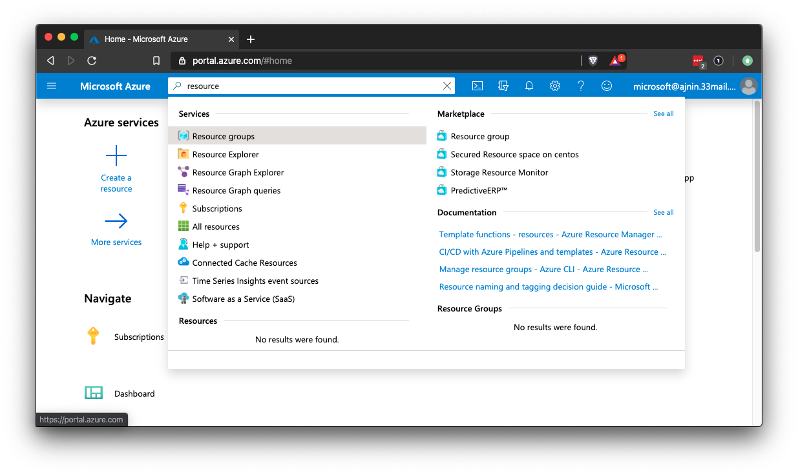

- Click on the **+ Add** button or the **Create resource group** button.

    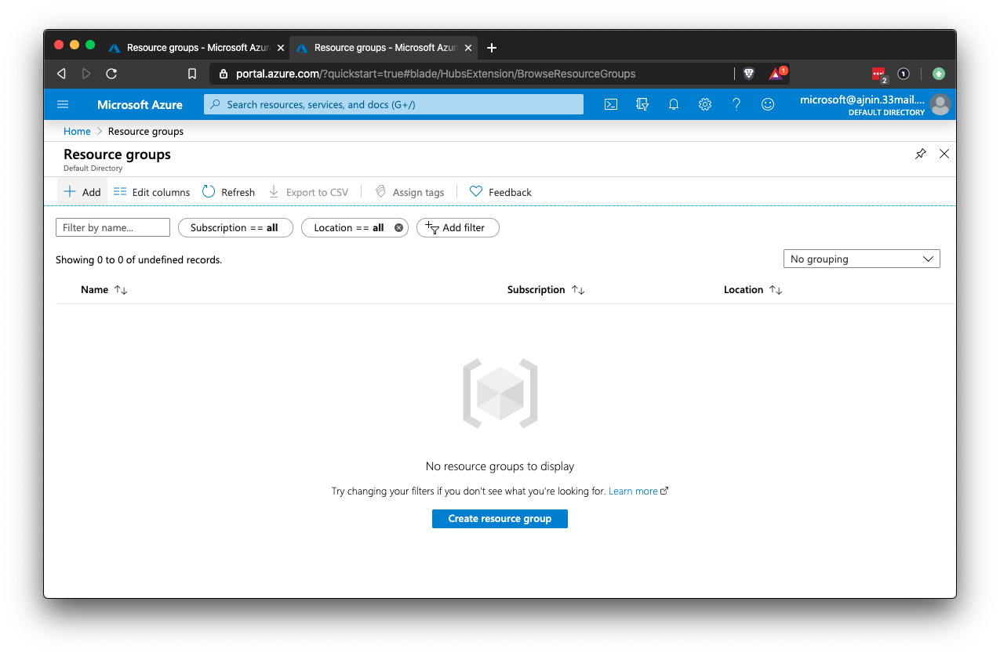

- Create a name for your resource group and choose a region.        
    - Note: Choose a region that you can easily remember. Every resource you create after this must be created in the exact same region.

- Click on **Review + create**.

    

- Azure will alert you if there are any errors. Click on **Create** to finalize your settings and create the group.

    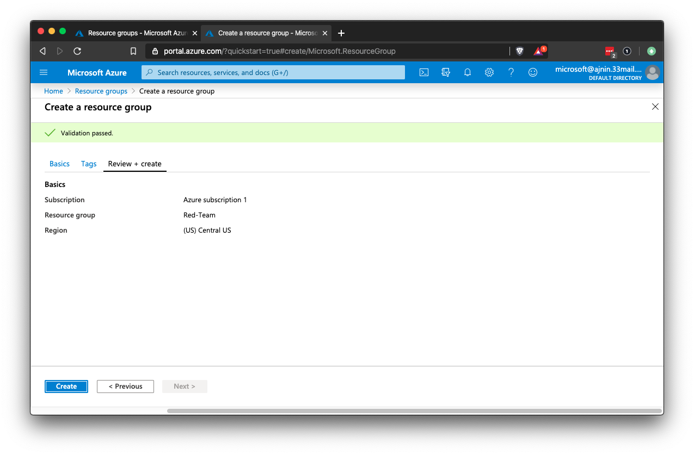

- Once the group is created, click on **Go to resource group** in the top-right corner of the screen to view your new resource group.

    

---

#### Setting up the VNet

Before you can deploy servers and services, there must be a network where these items can be accessed.

- This network should have the capacity to hold any resource that the Red Team needs, now and in the future.

- Return to the home screen and search for "net." Choose the search result for **Virtual networks**.

    

- Click on the **+ Add** button on the top-left of the page or the **Create virtual network** button on the bottom of the page.

     

Fill in the network settings:

- Subscription: Your free subscription should be the only option here.

- Resource group: This should be the resource group you created in step two.

- Name: A descriptive name so it will not get confused with other cloud networks in the same account.

- Region: Make sure to choose the same region you chose for your resource group. 

    - Carefully configuring the region of your resources is important for ensuring low latency and high availability. Resources should be located as close as possible to those who will be consuming them.

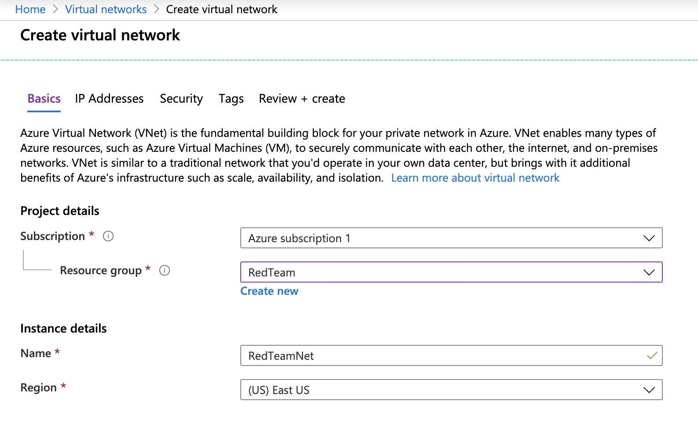

- IP Addresses: Azure requires you to define a network and subnet.
    - Use the defaults on this tab.

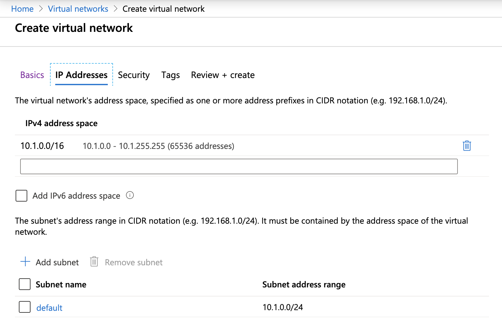

- Security: Leave the default settings.


- Tags: No tags are needed.


Click **Create**.

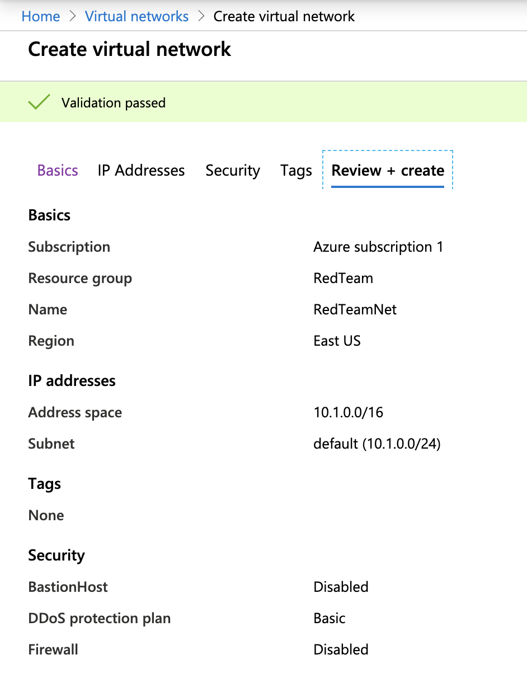

Once you have created your resource group and VNet, return to the home screen and choose the resource group option. 
- This provides a list of all resource groups in your account. 
- Choose the group that you created and you should see your VNet listed as a resource. 

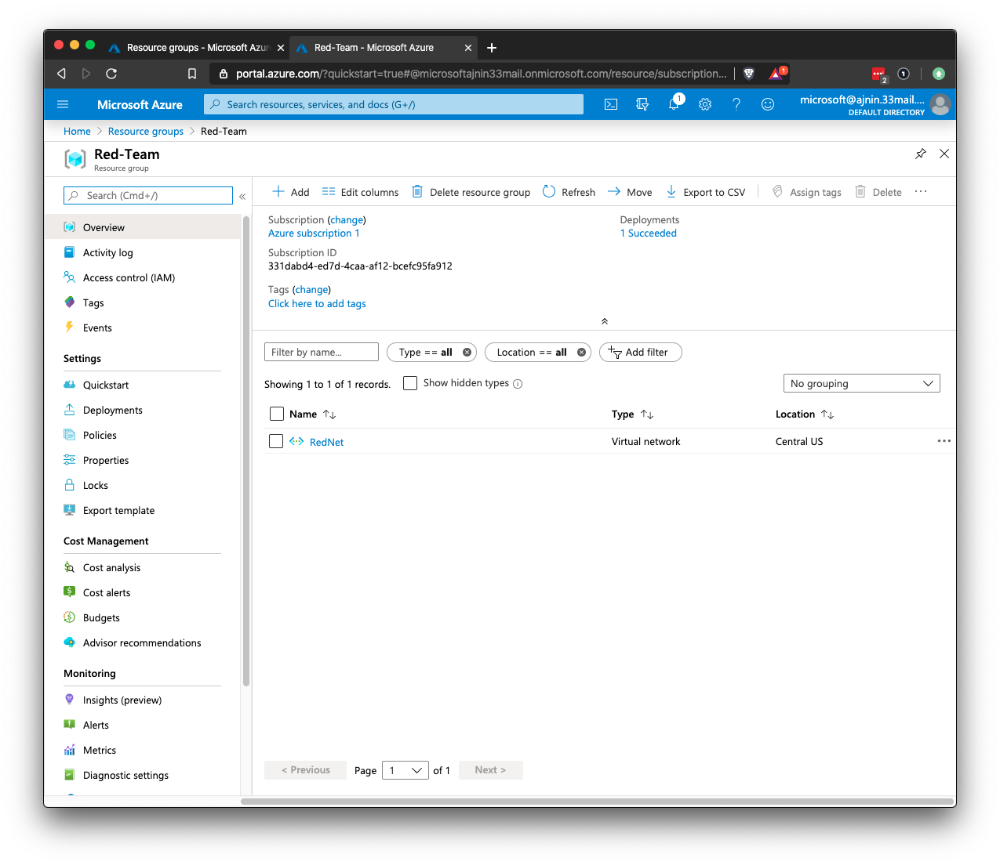

You now have a resource group and VNet that you can use to create the rest of the cloud infrastructure throughout the unit.

---

#### Setting up a Network Security Group:

- On your Azure portal home screen, search "net" and choose **Network security groups**. 

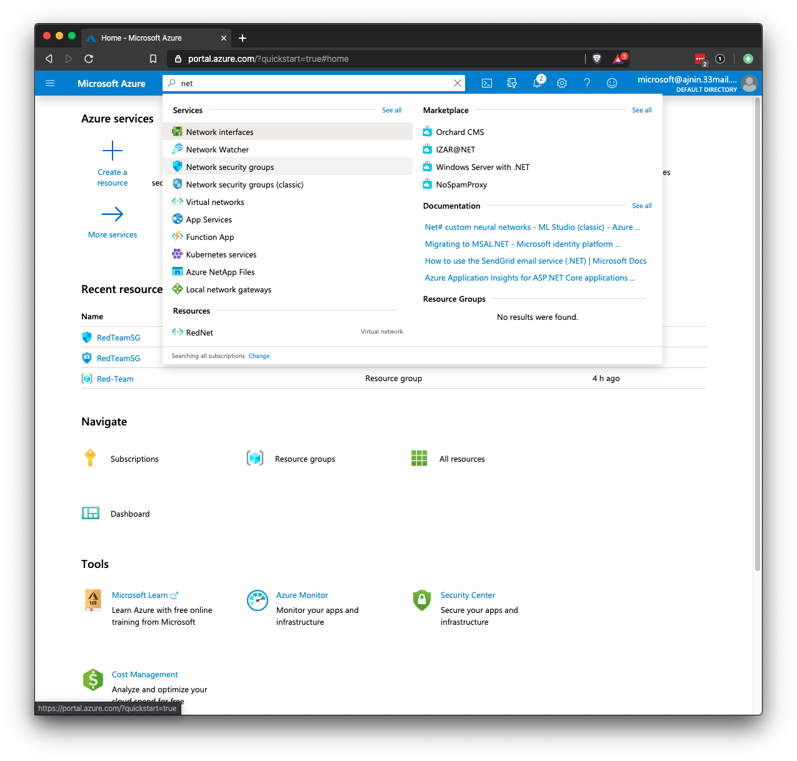

- Create a new security group.

- Add this security group to your resource group.

- Give the group a recognizable name that is easy to remember.

- Make sure the security group is in the same region that you chose during the previous activity.


To create an inbound rule to block all traffic:

- Once the security group is created, click on the group to configure it.

- Choose **Inbound security rules** on the left.

- Click on the **+ Add** button to add a rule.

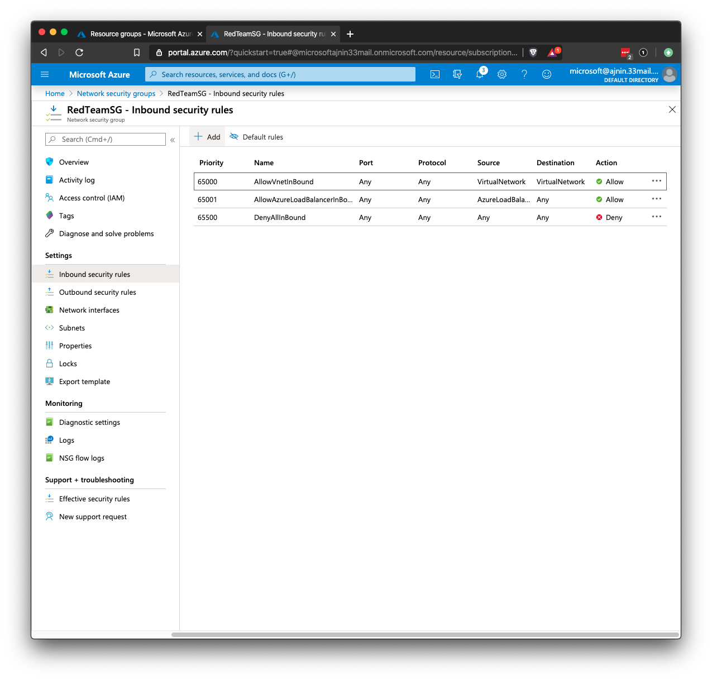

Configure the inbound rule as follows:

- Source: Choose **Any** source to block all traffic.

- Source port ranges: Source ports are always random, even with common services like HTTP. Therefore, keep the wildcard (*) to match all source ports.

- Destination: Select **Any** to block any and all traffic associated with this security group.

- Destination port ranges: Usually, you would specify a specific port or a range of ports for the destination. In this case, you can use the wildcard (*) to block all destination ports. You can also block all ports using a range like `0-65535`.

- Protocol: Block **Any** protocol that is used.

- Action: Use the **Block** action to stop all of the traffic that matches this rule.

- Priority: This rule will always be the last rule, so it should have the highest possible number for the priority. Other rules will always come before this rule. The highest number Azure allows is 4,096.

- Name: Give your rule a name like "Default-Deny."

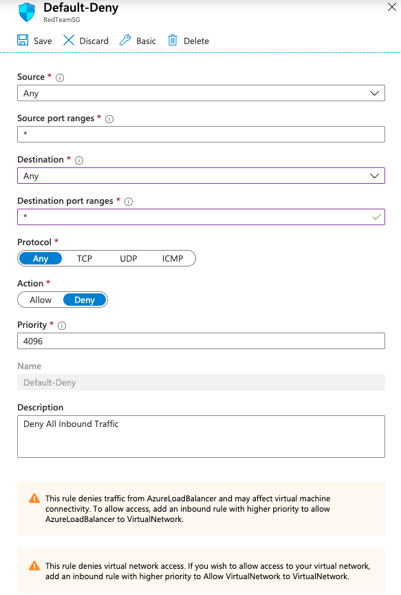

- Description: Write a quick description similar to "Deny all inbound traffic."

- Save the rule.

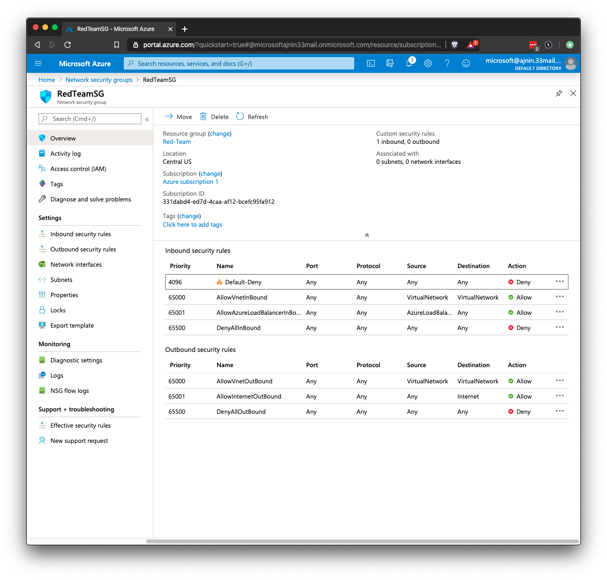

You should now have a VNet protected by a network security group that blocks all traffic.

#### Setting up Virtual Machines

The goal of this activity was to set up your first virtual machines inside your cloud network, which is protected by your network security group. You will use this machine as a jump box to access your cloud network and any other machines inside your VNet.

---

Remember: Allowing a server to use password authentication for SSH is insecure because the password can be brute forced.

- Therefore, we will only use cryptographic SSH keys to access our cloud servers. Password authentication will not be allowed. 

- This is part of the "ground up" security approach that we have been discussing. 

Open your command line and run `ssh-keygen` to create a new SSH key pair.
    - DO NOT CREATE A PASSPHRASE, just press enter twice.

- Your output should be similar to:

    ```bash
    cyber@2Us-MacBook-Pro ~ % ssh-keygen
    Generating public/private rsa key pair.
    Enter file in which to save the key (/Users/cyber/.ssh/id_rsa):
    Enter passphrase (empty for no passphrase): 
    Enter same passphrase again: 
    Your identification has been saved in id_rsa.
    Your public key has been saved in id_rsa.pub.
    The key fingerprint is:
    SHA256:r3aBFU50/5iQbbzhqXY+fOIfivRFdMFt37AvLJifC/0 cyber@2Us-MacBook-Pro.local
    The randomart image is:
    +---[RSA 2048]----+
    |         .. . ...|
    |          o. =..+|
    |         o .o *=+|
    |          o  +oB+|
    |        So o .*o.|
    |        ..+...+ .|
    |          o+++.+ |
    |        ..oo=+* o|
    |       ... ..=E=.|
    +----[SHA256]-----+
    ```

Run `cat ~/.ssh/id_rsa.pub` to display your `id_rsa.pub` key:

- Your output should be similar to:

    ```bash
    cyber@2Us-MacBook-Pro ~ % cat ~/.ssh/id_rsa.pub 

    ssh-rsa AAAAB3NzaC1yc2EAAAADAQABAAABAQDGG6dBJ6ibhgM09U+kn/5NE7cGc4CNHWXein0f+MciKElDalf76nVgFvJQEIImMhAGrtRRJDAd6itlPyBpurSyNOByU6LX7Gl6DfGQKzQns6+n9BheiVLLY9dtodp8oAXdVEGles5EslflPrTrjijVZa9lxGe34DtrjijExWM6hBb0KvwlkU4worPblINx+ghDv+3pdrkUXMsQAht/fLdtP/EBwgSXKYCu/
    ```

- Highlight and copy the SSH key string to your clipboard. 

---

#### VM 1 - Jump-Box

Open your Azure portal and search for "virtual machines."

- Use the **+ Add** button or the **Create virtual machine** button to create a new VM.

    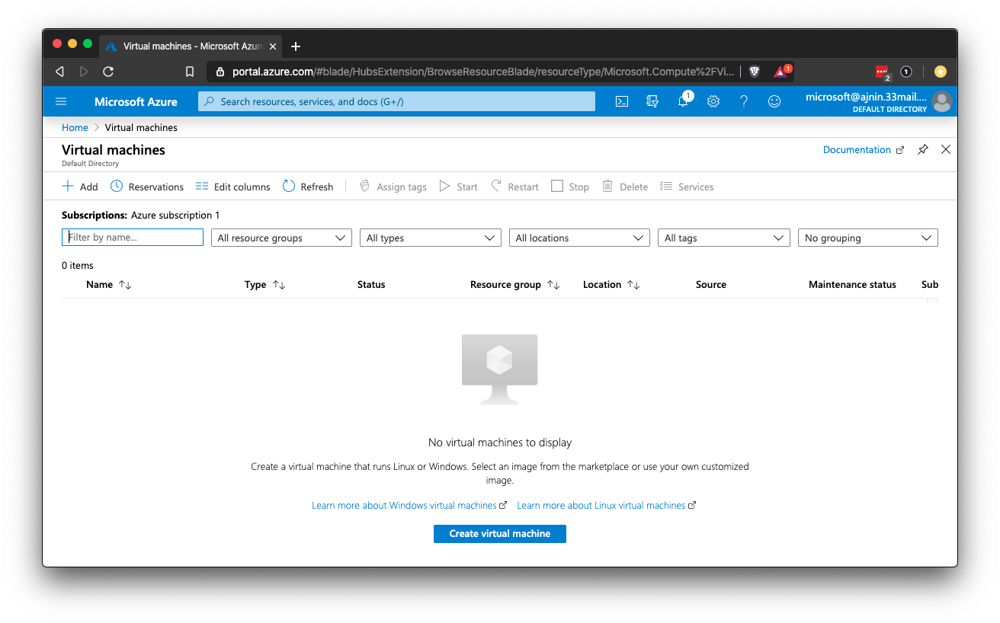

Use the following settings for this VM: 

- Resource group: Choose the same resource group that you created for the Red Team.

- Virtual machine name: Use the name "Jump Box Provisioner."

- Region: Use the same region that you used for your other resources.
	- Note that availability of VM's in Azure could cause you to change the region where your VM's are created.
	- The goal is to create 3 machines in the same resource group attached to the same security group. If you cannot add 3 machines to the resource group and security group that you have, a new resource group and security group may need to be created in another region.

- Availability options: We will use this setting for other machines. For our jump box, we will leave this on the default setting.

- Image: Choose the Ubuntu Server 18.04 option.

- Choose the VM option that has:
  - Whose offering is **Standard - B1s**
  - 1 CPU
  - 1 RAM

For SSH, use the following settings: 

- Authentication type: SSH public key.

- Username: Create any username you like.

- SSH public key: Paste the public key string that you copied earlier.

- Public inbound ports: Ignore this setting. It will be overwritten when you choose your security group.

- Select inbound ports: Ignore this setting. It will be overwritten when you choose your security group.

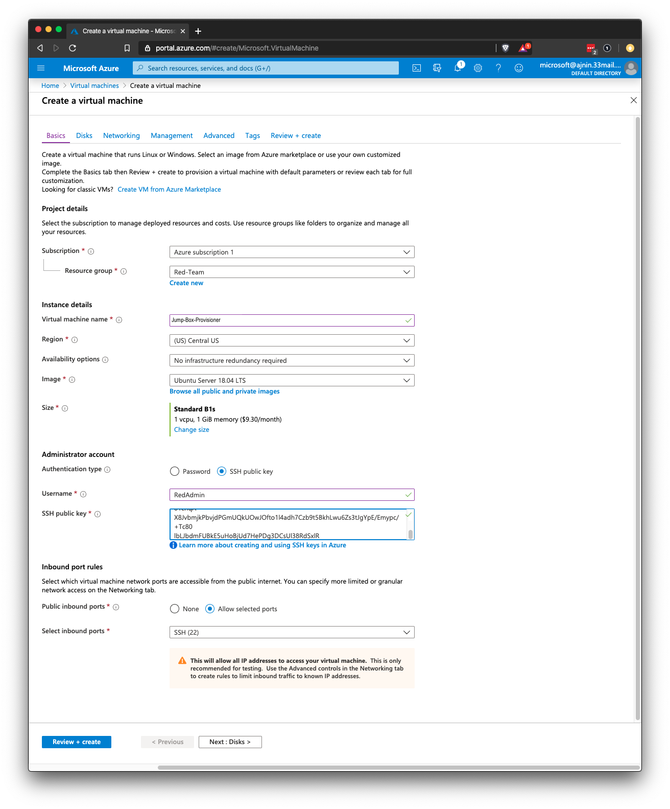

Move to the **Networking** tab and set the following settings:

- Virtual network: Choose the VNet you created for the Red Team.

- Subnet: Choose the subnet that you created earlier.

- Public IP: This can be kept as default. 

- NIC network security group: Choose the Advanced option so we can specify our custom security group.

- Configure network security group: Choose your Red Team network security group.

- Accelerated networking: Keep as the default setting (Off).

- In the Networking settings, take note of the VM URL. You may use it later.

- Load balancing: Keep as the default setting (No).

    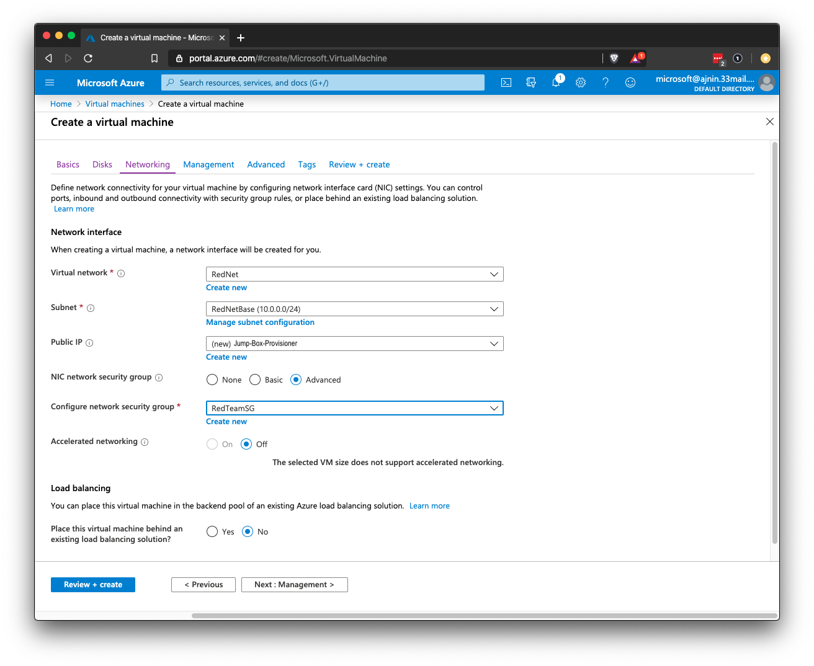

- Click on **Review + create**.

    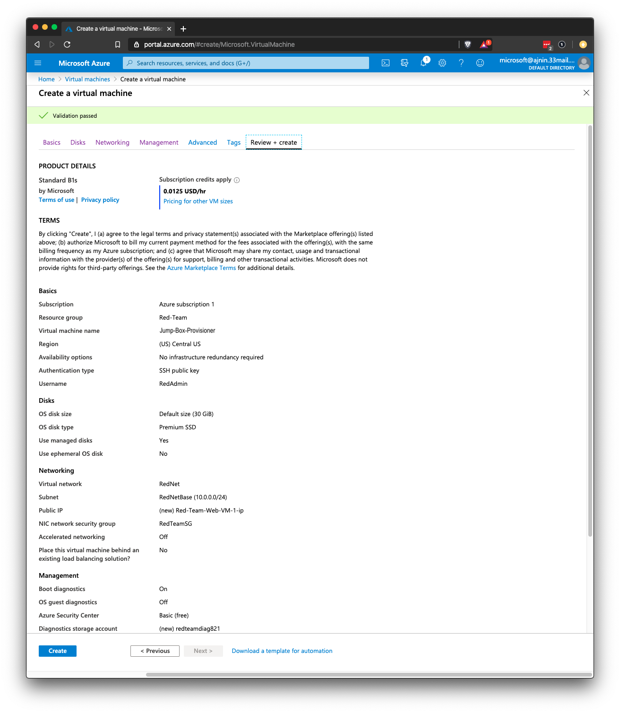

- Finalize all your settings and create the VM by clicking on the **Create** button.

#### VM's 2 and 3 - Web VM's

Create 2 more new VMs. Keep the following in mind when configuring these VM's:
- Each VM should be named "Web-1" and "Web-2"

- These VM's need to be in the same resource group you are using for all other resources.

- The VM's should be located in the same region as your resource group and security group.
	- Note that availability of VM's in Azure could cause you to change the region where your VM's are created.
	- The goal is to create 3 machines in the same resource group attached to the same security group. If you cannot add 3 machines to the resource group and security group that you have, a new resource group and security group may need to be created in another region.

- The administrative username should make sense for this scenario. You should use the same admin name for all 3 machines. Make sure to take a note of this name as you will need it to login later.

- **SSH Key:** Later in the lab setup, we will overwrite these SSH keys. For now, use the SSH key that you created in the first VM setup.
    - Run: `cat ~/.ssh/id_rsa.pub` and copy the key.

- Choose the VM option that has:
  - Whose offering is **Standard - B1ms**
  - 1 CPU
  - 2 RAM

**Note:** These web machines should have _2 GB_ of RAM and the Jump-Box only needs _1 GB_. All 3 machines should only have _1 vCPU_ because the free Azure account only allows _4 vCPU's_ in total per region.

**VERY IMPORTANT:** Make sure both of these VM's are in the same availability Set. Machines that are not in the same availability set cannot be added to the same load balancer later, and will have to be deleted and recreated in the same availability set.  
- Under Availability Options, select 'Availability Set'. Click on 'Create New' under the Availability set. Give it an appropriate name. After creating it on the first VM, choose it for the second VM.


In the **Networking** tab and set the following settings:

- Virtual network: Choose the VNet you created for the Red Team.

- Subnet: Choose the subnet that you created earlier.

- Public IP: NONE! Make sure these web VM's do not have a public IP address.

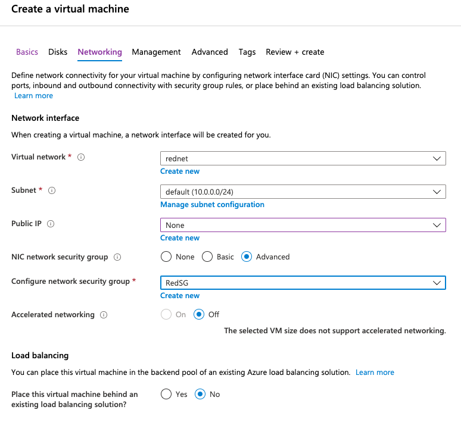

- NIC network security group: Choose the Advanced option so we can specify our custom security group.

- Configure network security group: Choose your Red Team network security group.

- Accelerated networking: Keep as the default setting (Off).

- In the Networking settings, take note of the VM URL. You may use it later.

- Load balancing: Keep as the default setting (No).

**NOTE:** Notice that these machines will not be accessible at this time because our security group is blocking all traffic. We will configure access to these machines in a later activity.

The final WebVM's should resemble the following:

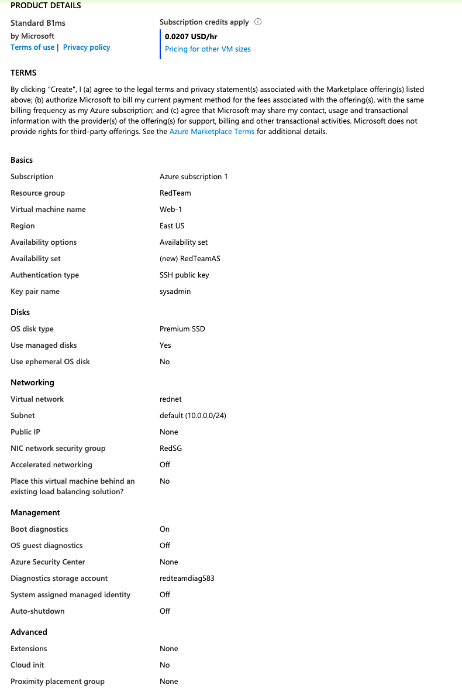


#### Setting up your Jump Box Administration

The goal of this activity was to create a security group rule to allow SSH connections only from your current IP address, and to connect to your new virtual machine for management.

---

1. Visit `whatsmyip.org` to get the IPv4 address of the network you are currently using.


Next, log into portal.azure.com to create a security group rule to allow SSH connections from your current IP address.

2. Find your security group listed under your resource group.

3. Create a rule allowing SSH connections from your IP address. 

    - Choose **Inbound security rules** on the left.

    - Click **+ Add** to add a rule.

        - Source: Use the **IP Addresses** setting, with your IP address in the field.

        - Source port ranges: Set to **Any** or * here.

		- Destination: This can be set **VirtualNetwork** but a better setting is to specify the internal IP of your jump box to really limit this traffic.

        - Destination port ranges: Since we only want to allow SSH, designate port `22`.

        - Protocol: Set to **Any** or **TCP**.

        - Action: Set to **Allow** traffic.

        - Priority: This must be a lower number than your rule to deny all traffic, i.e., less than 4,096. 

        - Name: Name this rule anything you like, but it should describe the rule. For example: `SSH`.

        - Description: Write a short description similar to: "Allow SSH from my IP." 


	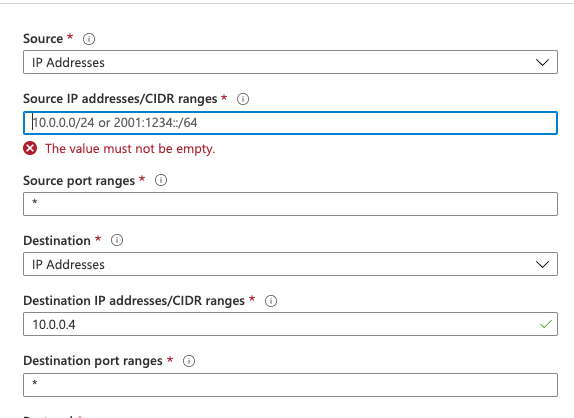


4. Use your command line to SSH to the VM for administration. Windows users should use GitBash.

    - The command to connect is `ssh admin-username@VM-public-IP`.

    - Use the username you previously set up. (Your SSH key should be used automatically.)

5. Once you are connected, check your `sudo` permissions.
    
    - Run the command `sudo -l`.

    - Notice that your admin user has full `sudo` permissions without requiring a password.

Please note that your public IP address will change depending on your location. 

-  In a normal work environment, you would set up a static IP address to avoid continually creating rules to allow access to your cloud machine. 

 - In our case, you will need to create another security rule allowing your home network to access your Azure VM. 


**NOTE:** If you need to reset your SSH key, you can do so in the VM details page by selecting 'Reset Password' on the left had column.

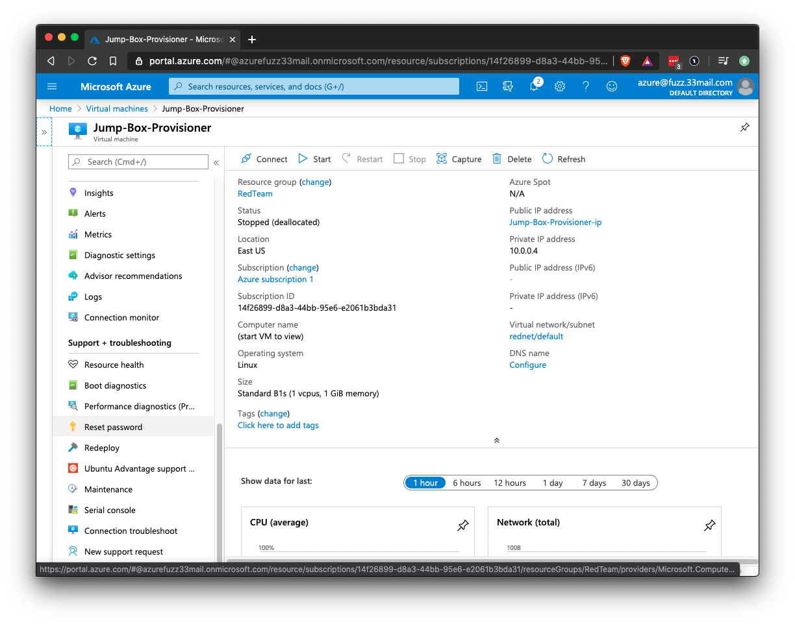

---

#### Docker Container Setup

The goal of this activity was to configure your jump box to run Docker containers and to install a container.

1. Start by installing `docker.io` on your Jump box.

    - Run `sudo apt update` then `sudo apt install docker.io`
    
  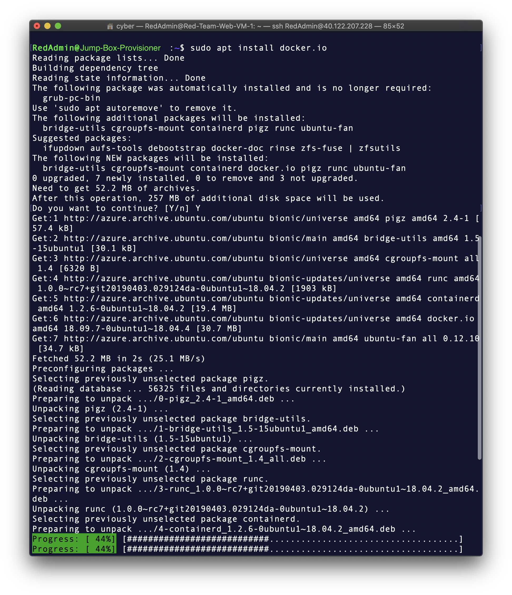

2. Verify that the Docker service is running.

    - Run `sudo systemctl status docker`

      - **Note:** If the Docker service is not running, start it with `sudo systemctl start docker`.

 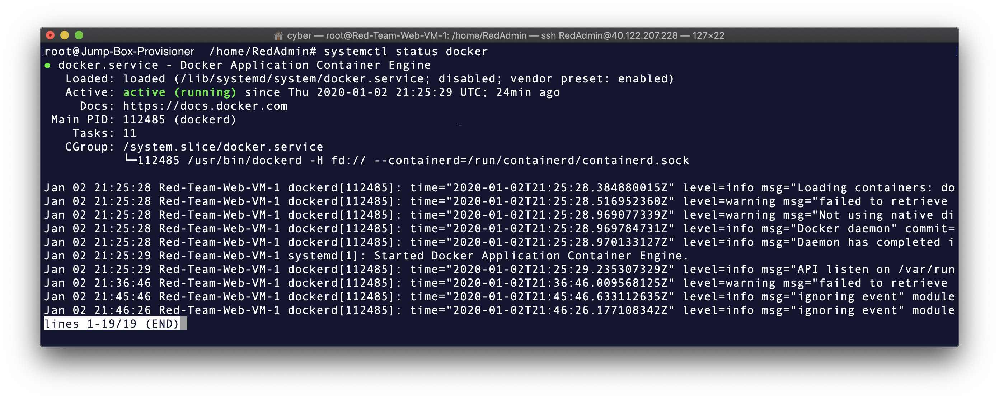

3. Once Docker is installed, pull the container `cyberxsecurity/ansible`.

    - Run `sudo docker pull cyberxsecurity/ansible`.


    - You can also switch to the root user so you don't have to keep typing `sudo`.

    - Run `sudo su`.


4. Launch the Ansible container and connect to it using the appropriate Docker commands.

    - Run `docker run -ti cyberxsecurity/ansible:latest bash` to start the container.

    - Run `exit` to quit.

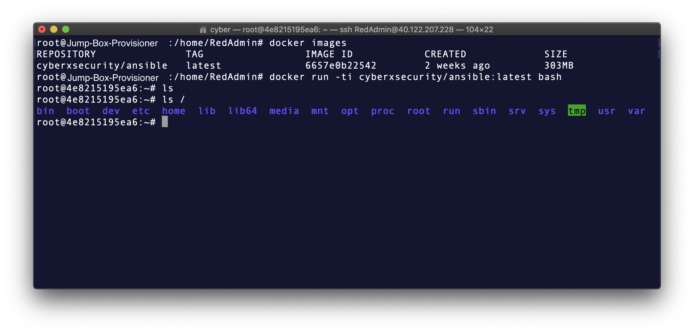

5. Create a new security group rule that allows your jump box machine full access to your VNet.

    - Get the private IP address of your jump box.

    

    - Go to your security group settings and create an inbound rule. Create rules allowing SSH connections from your IP address.

       - Source: Use the **IP Addresses** setting with your jump box's internal IP address in the field.

        - Source port ranges: **Any** or * can be listed here.

        - Destination: Set to **VirtualNetwork**.

        - Destination port ranges: Only allow SSH. So, only port `22`.

        - Protocol: Set to **Any** or **TCP**.

        - Action: Set to **Allow** traffic from your jump box.

        - Priority: Priority must be a lower number than your rule to deny all traffic.

        - Name: Name this rule anything you like, but it should describe the rule. For example: `SSH from Jump Box`.

        - Description: Write a short description similar to: "Allow SSH from the jump box IP."

        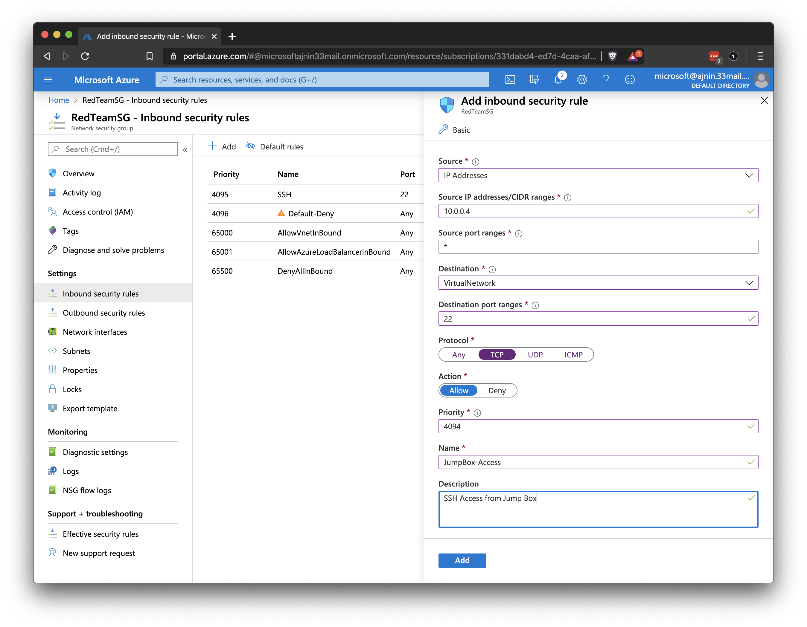

Your final security group rules should be similar to this:

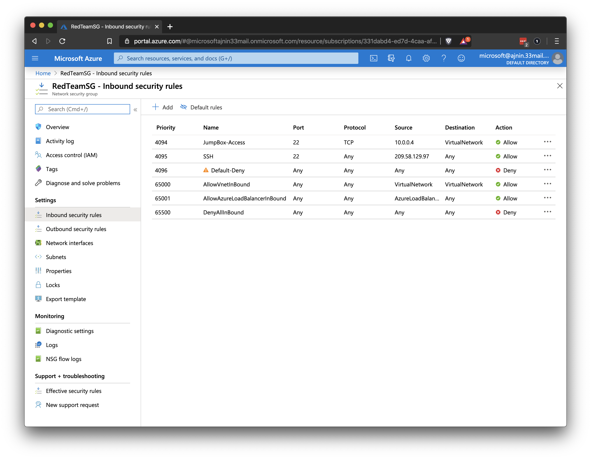

---
---
© 2020 Trilogy Education Services, a 2U, Inc. brand. All Rights Reserved.
